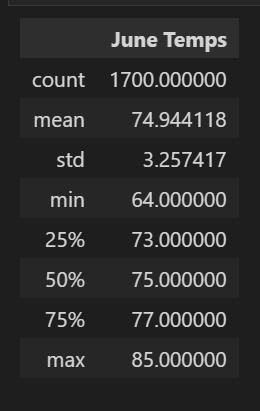
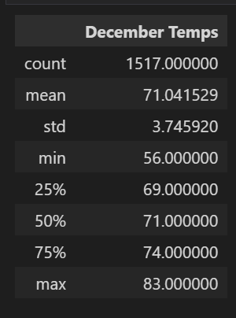

# Surfs Up Analysis

## Overview

This project aims to analyse temperature data from Oahu island in order to evaluate the feasibility of a business, which may be susceptible to seasonality. This analysis used a jupyter notebook, pandas, sqlalchemy, and SQLite.

## Results

- Data was collected and summarized in June and December for several years.
- June summary shows an average temperature of 74.944118, having a minimum temperature of 64 and a maximum of 85.
- For December data, the average is 71.041529, with a minimum of 56 and a maximum of 83.
- Both summaries are presented below:




## Summary

When comparing June and December data, there is little variation in the maximum temperature, just 2 degrees below in December. The minimum temperature registered in December is 8 degrees lower than in June. However, the average temperature presented in December is just slightly lower than in June, 71.041529 and 74.944118, respectively. It may indicate that a business reliant on higher temperatures can succeed in this location. 

Still, analysing data from two specific months may not be enough to ensure this business's viability. It would be beneficial to observe how temperature varies throughout the year, which could be done by quarters. For example:

```
# Filter temperature data from March
session.query(Measurement.date, Measurement.tobs).filter(extract('month', Measurement.date)==3).all()

# Filter temperature data from September
session.query(Measurement.date, Measurement.tobs).filter(extract('month', Measurement.date)==9).all()
```

Similarly, analysing precipitation info would contribute to understanding the potential of a business on the island.

```
# Filter precipitation data for June
session.query(Measurement.date, Measurement.prcp).filter(extract('month', Measurement.date)==6).all()

# Filter precipitation data for December
session.query(Measurement.date, Measurement.prcp).filter(extract('month', Measurement.date)==12).all()
```

